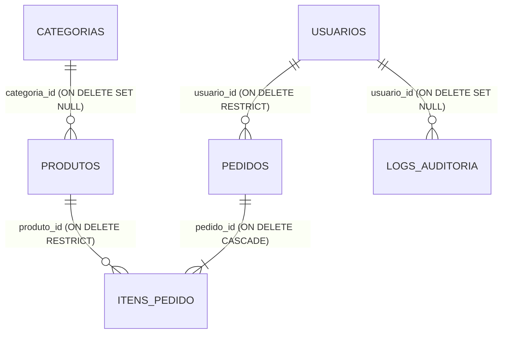

# Documentação das Relações e Integridade Referencial — Loja Virtual

Esta documentação descreve as relações lógicas entre as tabelas do banco de dados `lojavirtual`, justificando as escolhas de restrições de integridade referencial (`FOREIGN KEYS` e ações `ON DELETE`) com foco em **Segurança, Auditoria e Integridade dos Dados** (requisitos fundamentais de Banco de Dados II).

---

## Diagrama Lógico de Relações

---

## Detalhamento das Relações

### 1. Usuários e Pedidos (`usuarios` ➡️ `pedidos`)
* **Cardinalidade**: Um Usuário possui de `0 a N` Pedidos (Um-para-Muitos).
* **Mapeamento**: Chave Estrangeira `usuario_id` na tabela `pedidos` apontando para `usuarios(id)`.
* **Ação Referencial**: **`ON DELETE RESTRICT`**
* **Justificativa de Segurança**: Impede a exclusão de um usuário do sistema caso ele possua compras ativas ou históricas registradas. Em um cenário real de e-commerce, a exclusão em cascata de dados de vendas viola leis fiscais e contábeis de auditoria financeira. Se o cliente solicitar a exclusão de sua conta (ex: LGPD), deve ser adotada a técnica de **anonimização** dos seus dados pessoais em `usuarios`, mas o registro histórico de vendas em `pedidos` deve ser estritamente preservado.

### 2. Categorias e Produtos (`categorias` ➡️ `produtos`)
* **Cardinalidade**: Uma Categoria possui de `0 a N` Produtos (Um-para-Muitos).
* **Mapeamento**: Chave Estrangeira `categoria_id` na tabela `produtos` apontando para `categorias(id)`.
* **Ação Referencial**: **`ON DELETE SET NULL`**
* **Justificativa**: Caso uma categoria de produtos seja excluída (ex: "Artigos de Verão" que deixa de existir sazonalmente), os produtos pertencentes a ela não devem ser excluídos. Eles passarão a ter a coluna `categoria_id` com o valor `NULL` (não categorizados) e poderão ser reclassificados manualmente pelo administrador sem interrupção de estoque.

### 3. Pedidos e Itens de Pedido (`pedidos` ➡️ `itens_pedido`)
* **Cardinalidade**: Um Pedido possui de `1 a N` Itens (Um-para-Muitos / Parte de Relação Muitos-para-Muitos).
* **Mapeamento**: Chave Estrangeira `pedido_id` na tabela `itens_pedido` apontando para `pedidos(id)`.
* **Ação Referencial**: **`ON DELETE CASCADE`**
* **Justificativa**: Os registros em `itens_pedido` dependem estritamente da existência do cabeçalho da compra na tabela `pedidos`. Caso um pedido venha a ser cancelado ou excluído físicamente (situação rara, geralmente resolvida por status 'cancelado'), os itens atrelados a ele perdem o sentido de existir no banco de dados e devem ser removidos em cascata para evitar dados órfãos e lixo no armazenamento.

### 4. Produtos e Itens de Pedido (`produtos` ➡️ `itens_pedido`)
* **Cardinalidade**: Um Produto pode figurar em `0 a N` Itens de Pedido (Um-para-Muitos / Parte de Relação Muitos-para-Muitos).
* **Mapeamento**: Chave Estrangeira `produto_id` na tabela `itens_pedido` apontando para `produtos(id)`.
* **Ação Referencial**: **`ON DELETE RESTRICT`**
* **Justificativa de Segurança**: Impede a deleção de qualquer produto que já tenha sido faturado em compras passadas. Se um produto cadastrado for excluído físicamente, o histórico financeiro da loja em `itens_pedido` perderia a referência de qual item foi adquirido, quebrando relatórios de vendas. Para remover um produto do catálogo ativo sem quebrar o banco, o administrador deve inativá-lo (ex: zerando estoque ou adicionando campo `ativo`), mas nunca excluí-lo fisicamente caso já tenha sido vendido.

### 5. Usuários e Logs de Auditoria (`usuarios` ➡️ `logs_auditoria`)
* **Cardinalidade**: Um Usuário (Administrador/Suporte/Cliente) pode gerar de `0 a N` Logs de Auditoria (Um-para-Muitos).
* **Mapeamento**: Chave Estrangeira `usuario_id` na tabela `logs_auditoria` apontando para `usuarios(id)`.
* **Ação Referencial**: **`ON DELETE SET NULL`**
* **Justificativa de Segurança**: Se um funcionário (usuário) da equipe técnica ou gerencial for excluído ou desativado da empresa, as ações críticas que ele realizou no banco de dados (que dispararam as triggers de log) devem ser permanentemente salvas para fins de compliance de segurança cibernética. O ID do usuário associado nos logs históricos é alterado para `NULL` (ou opcionalmente registrado em formato texto no campo `detalhes`), preservando a rastreabilidade da modificação dos dados.

---

## Índices e Restrições Adicionais (CHECK)

- **`idx_usuarios_email` (UNIQUE INDEX)**: Garante a unicidade de e-mails em nível físico de banco de dados e melhora a performance de consultas durante o login.
- **`chk_preco` e `chk_preco_unitario` (CHECK > 0)**: Bloqueiam inserções ou alterações de valores nulos ou negativos nos produtos ativos e itens vendidos, evitando falhas de integridade econômica no banco.
- **`chk_quantidade` (CHECK > 0)**: Impede a realização de pedidos com quantidade de itens zerada ou negativa.
